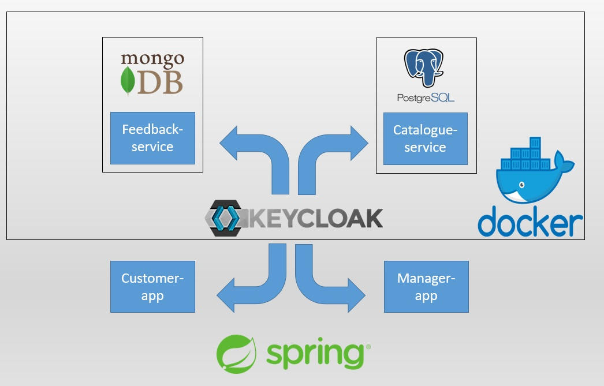

# **_Phase 1_** : Testing and Documentation
Das Ziel dieses Projekts ist es, alle geschriebene Klassen **vollständig zu testen und zu dokumentieren**. Durch die Entwicklung von Microservices wird ein Onlineshop modelliert. Das folgende Schema wird dies etwas näher erläutern:



## Technologie:
- Spring MVC & Spring Reactive
- Spring Security & OAuth2 & Keycloak
- PostgreSQL & Reactive MongoDB
- AsciiDoc & OpenAPI & Swagger
- Mock & JUnit & Testcontainers
- Lombok & Thymeleaf & Devtools
- Admin Server
- Victoria Metrics & Loki & Grafana
- 
# Microservice:

- ## Keycloak

Keycloak ist ein Open-Source-Identity- und Access-Management-System, das Login-Funktionalität bietet. Es ermöglicht die Verwaltung von Benutzern, die Authentifizierung und Autorisierung von Benutzerzugriffen auf verschiedene Anwendungen und Dienste sowie die Integration von externen Identitätsanbietern.

Um einen Keycloak-Container zu erstellen, können Sie den folgenden Befehl verwenden:
```
docker run --name shopping4you-keycloak -p 8082:8080 -e KEYCLOAK_USER=admin -e KEYCLOAK_PASSWORD=admin quay.io/keycloak/keycloak:23.0.7
```
Dieser Befehl erstellt einen Container mit dem Namen "shopping4you-keycloak", der den Keycloak-Server auf Port 8082 (externer Port) und Port 8080 (Container-Port) startet. Die Umgebungsvariablen KEYCLOAK_USER und KEYCLOAK_PASSWORD werden verwendet, um das Administratorkonto von Keycloak zu konfigurieren. Sie können diese Werte entsprechend Ihren Anforderungen ändern.

#### Einloggen und Realm erstellen

Um sich bei Keycloak einzuloggen und den erstellten Realm "shopping2" auszuwählen, können Sie wie folgt vorgehen:

1. Öffnen Sie einen Webbrowser und navigieren Sie zur Adresse [http://localhost:8082/auth/admin](http://localhost:8082/auth/admin).
2. Geben Sie den Benutzername und das Passwort ein, die Sie beim Starten des Keycloak-Containers festgelegt haben (in diesem Fall sind es "admin" und "admin"). 
3. Klicken Sie auf den Dropdown-Menü neben dem aktuellen Realm-Namen (normalerweise "master") in der oberen linken Ecke der Seite.
4. Wählen Sie "Add realm" aus und geben Sie "shopping2" als Namen des neuen Realms ein und klicken Sie auf "Create" oder "Erstellen". 
5. Klicken Sie auf "Add user" und geben Sie die erforderlichen Informationen für den Benutzer ein.
6. Weitere Informationen zu Keycloak finden Sie unter [Link zur weiteren Information](https://www.keycloak.org/documentation).

- ## Manager-app:

Mithilfe von Thymeleaf wird eine UI für die Steuerung des Katalogs bereitgestellt. Sie ermöglicht das Erstellen, Ändern und Löschen von Waren.

- ## Customer-app:

Mithilfe von Thymeleaf wird eine UI für das Anschauen von Waren aus dem Katalog bereitgestellt. Sie ermöglicht das Erstellen von Feedback wie Bewertungen und Benotungen sowie das Hinzufügen und Löschen von Lieblingswaren(Einkaufskorb).

- ## Catalogue-service:

REST-API zum Speichern von Waren aus dem Katalog mithilfe von PostgreSQL.
Um einen PostgreSQL-Container mithilfe von Docker zu erstellen, verwenden Sie den folgenden Befehl:
```
docker run --name catalogue-db -p 5433 -e POSTGRES_USER=postgre -e POSTGRES_PASSWORD=12345678 -e POSTGRES_DB=shopping2 postgres:16
```
Diese Version weist darauf hin, dass Sie das Passwort und den Benutzernamen entsprechend Ihren Anforderungen ändern müssen, und empfiehlt, dass Sie diese Änderungen auch in der `application-standalone.yaml` -Datei des Microservices vornehmen.

#### Das Aufrufen der Catalogue-Service-Endpunkte mit der Hilfe von Swagger:
```
http://localhost:8081/swagger-ui/index.html
```
Um Swagger zu verwenden, müssen Sie einen neuen Client mit der Client-ID "catalogue-service-swagger-ui" in Keycloak erstellen und ihm die Rolle "ROLE_MANAGER" zuweisen.

- ## Feedback-service

Der Feedback-Service ermöglicht das Speichern und Steuern von Bewertungen und Benotungen sowie das Hinzufügen und Löschen von Waren in den Favoriten (ähnlich wie der Warenkorb in einem Online-Shop). Alle Daten werden in MongoDB gespeichert.
Um einen MongoDB-Container zu erstellen, können Sie den folgenden Befehl verwenden:
```
docker run --name feedback-db -p 27017:27017 mongo:7
```

# Dokumentation für den Feedback-Service

Die Dokumentation für den Feedback-Service wurde mithilfe des Asciidoctor-Maven-Plugins erstellt, das Snippets verwendet, um die relevanten Informationen über die API-Endpunkte, Anfragen und Antworten sowie andere Details zu generieren.

Um sicherzustellen, dass die Dokumentation korrekt ist, wurde am Ende des Erstellungsprozesses `maven verify` ausgeführt.

Die vollständige Dokumentation ist [hier](https://github.com/ValentynHor/Testing-Documentation/blob/master/feedbackDocumentation.html) verfügbar. (feedbackDocumentation.html)

# Testen

Um das Testprotokoll einzusehen, klicken Sie [hier](test.log). (test.log)

# **_Phase 2_** : Administration

Im Rahmen dieser Phase wurde der Admin Server erfolgreich in die Infrastruktur integriert. Als zentrale Anlaufstelle ermöglicht er Administratoren die Verwaltung und Überwachung der Microservices. Durch die Integration wichtiger Metriken und Protokolle können potenzielle Probleme frühzeitig erkannt und behoben werden, was die Gesamtleistung und Zuverlässigkeit des Systems verbessert. Die benutzerfreundliche Benutzeroberfläche des Admin Servers erleichtert den Zugriff und die Verwaltung aller Microservices, optimiert den Verwaltungsprozess und fördert die zentrale Steuerung der Systemlandschaft.
Zusätzlich wurde die Spring Security entsprechend angepasst, um eine sichere Kommunikation zwischen dem Admin Server und den Microservices zu gewährleisten.Dies ermöglicht eine granulare Authentifizierung und Autorisierung für jeden Microservice, um auf die Metriken-Server zuzugreifen.

# **_Phase 3_** : Monitoring and Logging

Im Rahmen dieser Phase wurde die Monitoring-Infrastruktur erfolgreich implementiert, indem VictoriaMetrics und Grafana integriert wurden. Diese Tools ermöglichen die Überwachung und Visualisierung wichtiger Metriken und Leistungsdaten.

Durch die Integration von VictoriaMetrics als zentraler Datenspeicher und Grafana als benutzerfreundliche Dashboard-Plattform kann man jetzt kritische Informationen wie CPU-Auslastung, Speichernutzung, Netzwerkleistung und andere relevante Metriken überwachen. Dies ermöglicht es, potenzielle Engpässe oder Leistungsprobleme frühzeitig zu erkennen und entsprechend zu reagieren, um die Gesamtleistung und Zuverlässigkeit des Systems zu optimieren.

Darüber hinaus bietet Grafana eine Vielzahl von Visualisierungsoptionen und Alarmierungsfunktionen, die es uns ermöglichen, benutzerdefinierte Dashboards zu erstellen und Warnmeldungen einzurichten, um auf kritische Ereignisse oder Abweichungen von definierten Schwellenwerten aufmerksam zu machen. Dies trägt dazu bei, die Verfügbarkeit und Stabilität der Anwendung sicherzustellen und die Ausfallzeiten zu minimieren.

Loki ermöglicht das Sammeln, Speichern und Analysieren von Protokolldaten aus verschiedenen Quellen in einem zentralen Service. Durch die Integration von Loki können sämtliche Protokolle von Anwendungen, Diensten und Systemkomponenten effizient gesammelt und in einem einheitlichen Format gespeichert werden. Dies erleichtert die Suche, Analyse und Visualisierung von Protokolldaten, was wiederum eine schnellere Fehlerbehebung und ein verbesserter Einblick in das Systemverhalten ermöglicht.

Durch die Kombination von Loki mit Grafana können wir außerdem benutzerdefinierte Dashboards erstellen, um sowohl Metriken als auch Protokolle in einer einzigen Ansicht zu visualisieren. Dies ermöglicht eine ganzheitliche Überwachung und Analyse des Systems und trägt dazu bei, die Effizienz und Zuverlässigkeit unserer Anwendung weiter zu verbessern.

Um Victoria Metrics als Docker-Container auszuführen, können Sie den folgenden Docker-Befehl verwenden:
```
docker run --name victoria-metrics -p 8428:8428 -v D:/Programming/Java/shopping4you/config/victoria/promscrape.yaml:/promscrape.yaml victoriametrics/victoria-metrics:v1.93.12  
```

Grafana:
```
docker run --name shopping4you-grafana -p 3000:3000 -v D:\Programming\Java\shopping4you\data\grafana:/var/lib/grafana grafana/grafana:10.2.4
```

Loki:
```
docker run --name shopping4you-loki -p 3100:3100 grafana/loki:2.9.4
```

# **_Phase 4_** : Tracing

Im Rahmen dieser Phase wurde auch das Tempo-Tracing erfolgreich integriert, um eine umfassende Tracing-Lösung zu schaffen. Tempo ist ein Open-Source-Tracing-System, das speziell für Cloud-native Umgebungen entwickelt wurde. Es ermöglicht die kontinuierliche Erfassung, Speicherung und Analyse von Tracing-Daten in großem Maßstab.

Durch die Integration von Tempo können Entwickler und Betreiber detaillierte Einblicke in die Abläufe und Interaktionen innerhalb ihrer Anwendungen gewinnen. Dies umfasst das Verfolgen von Anfragen durch verschiedene Dienste und Komponenten, das Aufdecken von Latenzproblemen und das Identifizieren von Engpässen in der Anwendungsarchitektur.

Grafana bietet eine Vielzahl von Visualisierungsoptionen, einschließlich Diagrammen, Grafiken und Dashboards, die es den Teams ermöglichen, einen ganzheitlichen Überblick über die Anwendungsleistung zu erhalten. Durch die visuelle Darstellung der Tracing-Daten in Grafana können Entwickler und Betreiber potenzielle Engpässe identifizieren, Trends erkennen und proaktiv auf Leistungsprobleme reagieren, um die Effizienz und Zuverlässigkeit der Anwendung zu maximieren.

Um Tracing in Ihrem Docker-Container für Projekt zu ermöglichen:

```
docker run --name shopping4you-tracing -p 3200:3200 -p 9095:9095 -p 4317:4317 -p 4318:4318 -p 9411:9411 -p 14268:14268 -v D:\Programming\Java\shopping4you\config\tempo\tempo.yaml:/etc/tempo.yaml  grafana/tempo:2.3.1 -config.file=/etc/tempo.yaml
```

# **_Phase 5_** : Eureka server

Im Rahmen dieser Phase wurde die Integration des Eureka-Servers erfolgreich durchgeführt, um eine umfassende Service-Registrierungs- und -Entdeckungslösung zu schaffen. Der Eureka-Server ist ein Open-Source-Tool, das speziell für Microservices-Architekturen entwickelt wurde und es ermöglicht, Dienste automatisch zu registrieren und ihre Verfügbarkeit zu überwachen.

Durch die Integration des Eureka-Servers können Entwickler und Betreiber einen zentralen Anlaufpunkt für die Verwaltung und Überwachung ihrer Mikroservices-Infrastruktur schaffen. Dies umfasst die automatische Registrierung und Entdeckung von Diensten, die Überwachung der Verfügbarkeit und die Erkennung von Ausfällen oder Engpässen in Echtzeit.


